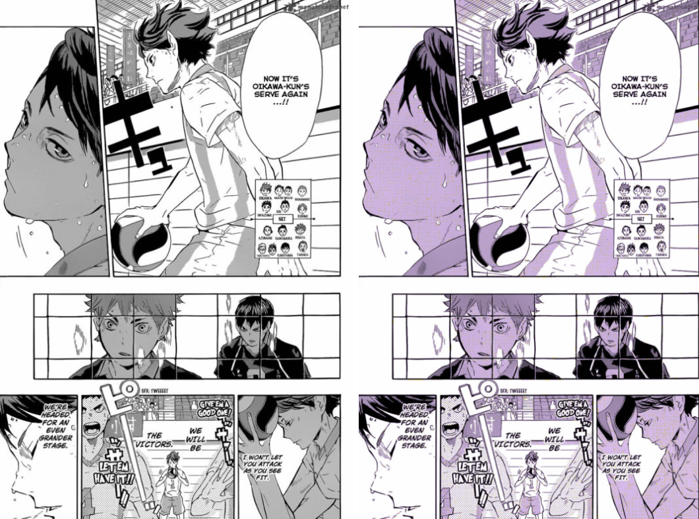
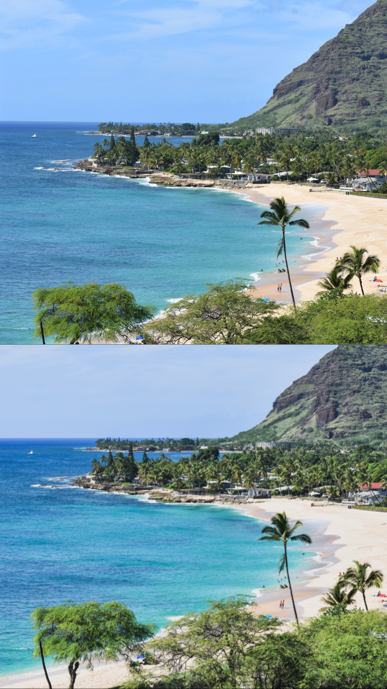

# drkrm

drkrm | pixel-perfect photo filters in python [link to repo](https://github.com/ursulaott/COMS4995)

## installation

`pip install drkrm==0.1.0`

[pipy page](https://pypi.org/project/drkrm/)

## documentation

check out documentation at [readthedocs](https://drkrm.readthedocs.io/en/latest/)

## description:
- a library of photo editing/filter effects in python that are free, easy to use, and highly fine-tune-able (kind of like lightroom presets)
- starting as a cli tool

## examples
 
